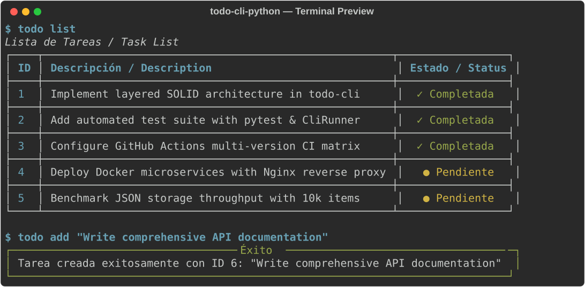

# ✅ To-Do CLI — Administrador Profesional de Tareas

[](https://github.com/aledash3/todo-cli-python/actions)
[](https://www.python.org/)
[](https://typer.tiangolo.com/)
[](https://rich.readthedocs.io/)
[](https://docs.pytest.org/)
[](LICENSE)
[](README.md)

Aplicación de línea de comandos (CLI) ligera, robusta y modular para la administración de tareas, desarrollada en Python mediante **Typer**, **Rich** y una arquitectura en capas fundamentada en los principios **SOLID**. Incluye persistencia portable en JSON, búsqueda por palabras clave, soporte para scripts no interactivos (`--yes`), tablas visuales con estilos avanzados y cobertura completa de pruebas automatizadas.

> 🌐 **Language / Idioma:** Español | [Switch to English documentation](README.md)

---

## 🖥️ Interfaz de Terminal

<p align="center">
  
</p>

---

## 📌 Descripción General

**To-Do CLI** está diseñada para desarrolladores y usuarios avanzados que buscan gestionar sus tareas cotidianas directamente desde la terminal con máxima rapidez y sin distracciones. Diseñada bajo estándares de ingeniería de software, desacopla la capa visual, la lógica de negocio y la persistencia mediante protocolos abstractos (DIP en SOLID).

---

## 🎯 Principales Aspectos de Arquitectura

- **Arquitectura en capas:** Separación estricta entre la interfaz CLI (`typer` + `rich`), el controlador de negocio (`TaskController`), el protocolo abstracto de persistencia y el modelo (`Task`).
- **Cumplimiento SOLID:** Aplica el **Principio de Inversión de Dependencias (DIP)** mediante el protocolo `TaskStorage`, permitiendo sustituir el motor de almacenamiento (JSON, SQLite, memoria) sin alterar la lógica de negocio.
- **Resolución inteligente de rutas:** Guarda las tareas por defecto en el directorio de usuario `~/.todo_cli/tasks.json` (configurable mediante la variable de entorno `TODO_CLI_PATH` o fallback en `./data/tasks.json`).
- **Automatización y Scripting:** Comandos como `remove` y `clear-completed` admiten el modificador `--yes / -y` para ejecutarse en pipelines de integración o scripts de shell sin bloquear la terminal.
- **Compatibilidad amplia:** Compatible con **Python 3.10, 3.11, 3.12 y 3.13**.
- **Pruebas automatizadas completas:** Suite con Pytest que valida modelos, recuperación ante archivos JSON corruptos, reglas de negocio y ejecución completa de comandos con `CliRunner`.

---

## 🏗 Estructura del Proyecto

```text
todo-cli-python/
├── .github/
│   └── workflows/
│       └── ci.yml               # Pipeline de CI multi-versión (Python 3.10 - 3.13)
├── tests/
│   ├── test_cli.py              # Pruebas de integración del CLI con CliRunner
│   ├── test_controllers.py      # Pruebas unitarias de lógica y excepciones
│   ├── test_models.py           # Pruebas de serialización de modelos
│   └── test_storage.py          # Pruebas de persistencia y recuperación de JSON
├── todo_cli/
│   ├── __init__.py              # Punto de entrada del paquete
│   ├── controllers.py           # Controlador y reglas de negocio
│   ├── main.py                  # Comandos y argumentos de Typer
│   ├── models.py                # Modelo Task con dataclass optimizado (slots)
│   ├── storage.py               # Protocolo TaskStorage e implementación JsonStorage
│   └── ui.py                    # Componentes visuales y tablas con Rich
├── pyproject.toml               # Configuración PEP 517/518 y entrypoint `todo`
├── requirements.txt             # Dependencias directas
├── LICENSE                      # Licencia MIT
├── README.md                    # Documentación técnica en inglés
└── README.es.md                 # Documentación en español
```

---

## ⚙️ Tecnologías Utilizadas

| Componente | Tecnología | Propósito |
| --- | --- | --- |
| **Lenguaje** | Python 3.10+ | Lenguaje base con tipado estático y slots |
| **Framework CLI** | Typer (Click) | Parsing de comandos, flags, ayuda y códigos de salida |
| **Interfaz de Terminal** | Rich | Tablas con estilos, paneles y formato enriquecido |
| **Persistencia** | JSON / Pathlib | Almacenamiento desacoplado con protocolo abstracto |
| **Pruebas** | Pytest | Suite de pruebas unitarias e integración |
| **Linter y Formato** | Ruff | Análisis estático ultrarrápido y formateo PEP 8 |

---

## 🚀 Instalación y Configuración

### Requisitos previos
- Python 3.10 o superior instalado.
- Gestor de paquetes `pip`.

### 1. Clonar el repositorio
```bash
git clone https://github.com/aledash3/todo-cli-python.git
cd todo-cli-python
```

### 2. Instalar el paquete en modo editable
Esto registrará el comando global `todo` en tu entorno:
```bash
pip install -e .
```

Para incluir las herramientas de pruebas:
```bash
pip install -e ".[test]"
```

---

## ▶️ Guía de Uso del CLI

### Comandos Disponibles

| Comando | Argumentos / Banderas | Descripción |
| :--- | :--- | :--- |
| `todo add` | `<descripción>` | Registra una nueva tarea |
| `todo list` | Ninguno | Muestra todas las tareas y estadísticas de resumen |
| `todo show` | `<id_tarea>` | Consulta el detalle específico de una tarea |
| `todo search` | `<término>` | Busca tareas por coincidencia en la descripción |
| `todo complete` | `<id_tarea>` | Marca una tarea pendiente como completada |
| `todo update` | `<id_tarea> <nueva_descripción>` | Modifica la descripción de una tarea |
| `todo remove` | `<id_tarea> [-y/--yes]` | Elimina una tarea (admite confirmación automática `-y`) |
| `todo pending` | Ninguno | Lista únicamente las tareas pendientes |
| `todo completed` | Ninguno | Lista únicamente las tareas completadas |
| `todo clear-completed`| `[-y/--yes]` | Elimina en lote todas las tareas completadas |
| `todo stats` | Ninguno | Muestra estadísticas generales de tareas |
| `todo version` | Ninguno | Muestra la versión instalada de la aplicación |

### Ejemplos Prácticos

```bash
# Registrar tareas
todo add "Revisar arquitectura en capas"
todo add "Configurar pipeline en GitHub Actions"

# Buscar tareas
todo search "GitHub"

# Marcar como completada
todo complete 1

# Listar tareas
todo list

# Eliminar sin confirmación interactiva
todo remove 2 --yes

# Limpiar todas las tareas completadas
todo clear-completed --yes
```

---

## 🧪 Ejecución de Pruebas y Calidad de Código

Ejecutar la suite completa con `pytest`:

```bash
pytest -v
```

Ejecutar el análisis estático de código con `ruff`:

```bash
ruff check .
```

Cada `push` y `pull request` ejecuta automáticamente la suite en **Python 3.10, 3.11, 3.12 y 3.13** mediante **GitHub Actions**.

---

## 👨‍💻 Autor

**David Alejandro Cruz Palacios**  
Estudiante de Ingeniería en Ciencias de la Computación — Universidad Politécnica Salesiana  
GitHub: [@aledash3](https://github.com/aledash3)

---

## 📄 Licencia

Este proyecto se distribuye bajo los términos de la [Licencia MIT](LICENSE).
